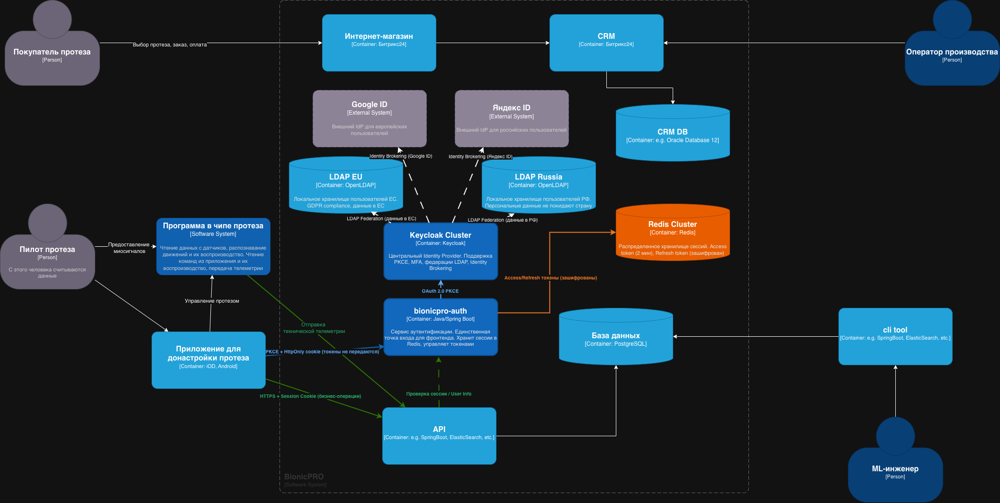

## Задача 1. Предложите архитектурное решение и доработайте диаграмму C4 для управления учётными данными пользователя. 

Обновление диаграммы C4
[BionicPRO.drawio](BionicPRO.drawio)


### Добавлены новые компоненты безопасности:

- `bionicpro-auth` - сервис аутентификации
- `Redis Cluster` - хранилище сессий и токенов
- `Keycloak Cluster` - центральный Identity Provider
- `LDAP Russia` и `LDAP EU` - локальные хранилища пользователей
- `Яндекс ID` и `Google ID` - внешние Identity Providers

### Добавлены новые связи с цветовым кодированием:

- 🔵 Синий - аутентификация (PKCE, токены)
- 🟢 Зеленый - бизнес-операции
- 🟠 Оранжевый - работа с кешем


### Архитектурное решение для управления учётными данными

1. Унификация доступа:
   - Keycloak как единый федератор для всех стран
   - Локальные LDAP серверы в РФ и ЕС
   - Персональные данные не покидают страну

2. Безопасная схема с токенами:
   - Фронтенд → только bionicpro-auth (HttpOnly cookie)
   - Access token (2 мин) в Redis, НЕ на фронтенде
   - Refresh token зашифрован в Redis
   - Ротация сессий при каждом запросе

3. Поддержка внешних IdP:
   - РФ: Яндекс ID через Identity Brokering
   - ЕС: Google ID через Identity Brokering


### Поток аутентификации:

1. Приложение → bionicpro-auth (запрос входа)
2. bionicpro-auth → Keycloak (PKCE Code Grant)
3. Keycloak → LDAP/External IdP (аутентификация)
4. Keycloak → bionicpro-auth (токены)
5. bionicpro-auth → Redis (сохранение токенов)
6. bionicpro-auth → Приложение (HttpOnly cookie)
7. Приложение → API (запросы с cookie)
8. API → bionicpro-auth (проверка сессии)


## Задача 2. Улучшите безопасность существующего приложения, заменив Code Grant на PKCE.

нужно настроить клиент в Keycloak и модифицировать фронтенд-приложение
- добавил параметр `"pkce.code.challenge.method": "S256"`  в конфиг Keycloak [realm-export.json](keycloak/realm-export.json)
- добавил опцию `pkceMethod: 'S256'` в [App.tsx](frontend/src/App.tsx)


## Задача 3. Обеспечьте безопасное получение и хранение access-и refresh-токенов.

- Добавлен бэкенд-сервис на java
- Перенесен механизм запроса access- и refresh-токен из фронтенда в новый бэкенд-сервис
- Обновлен код фронтенд-приложения, убран механизм получения токенов и сделано прокидывание на бэкенд сессионной cookie.


## Задача 4. Добавьте LDAP для возможности получения данных о пользователях представительства BionicPRO в другой стране.

- Проверьте пользователей в LDAP
```shell

docker-compose exec ldap ldapsearch -x -H ldap://localhost:389 \
  -D "cn=admin,dc=bionicpro,dc=local" \
  -w admin \
  -b "dc=bionicpro,dc=local" \
  | grep -E "dn:|uid:|mail:"
```


## Задача 5. Настройте MFA.

Добавлена авторизация через приложение для MFA.
При первом входе по логину/паролю предлагается отсканировать qr-код через приложение и указать код.
При следующем входе ожидает ввода временного кода из приложения MFA.


## Задача 6. Добавьте OAuth 2.0 от Яндекс ID.

Добавлена кнопка входа через Яндекс ID на странице авторизации keylock.
Для работы с Яндекс ID необходимо указать в docker-compose.yaml правильные значения полей:
"clientId": "YOUR_YANDEX_CLIENT_ID",
"clientSecret": "YOUR_YANDEX_CLIENT_SECRET",


