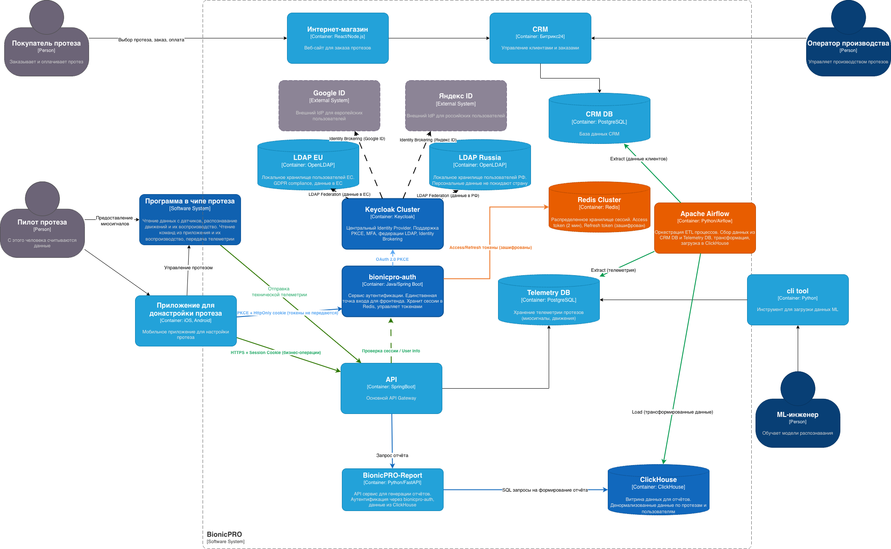

### Задача 1. Создать архитектуру решения для подготовки и получения отчётов. 

### Архитектура BionicPRO

Новые компоненты сервиса отчётов:
- Apache Airflow - оркестрация ETL процессов
- ClickHouse - OLAP витрина данных
- BionicPRO-Report - API для отчётов

ETL процесс:
- Extract: выгрузка из CRM DB и Telemetry DB
- Transform: очистка, денормализация, агрегация
- Load: загрузка в ClickHouse (витрина данных)

Поток запроса отчёта:
1. Пользователь → Frontend (запрос отчёта)
2. Frontend → API (с Session Cookie)
3. API → BionicPRO-Report (прокси)
4. BionicPRO-Report → ClickHouse (SQL)
5. BionicPRO-Report → API → Frontend (PDF/JSON)

Обновление диаграммы C4
[BionicPRO-task2.drawio](BionicPRO-task2.drawio)

- 🔵 Синий - аутентификация (PKCE, токены)
- 🟢 Зеленый - бизнес-операции
- 🟠 Оранжевый - работа с кешем

